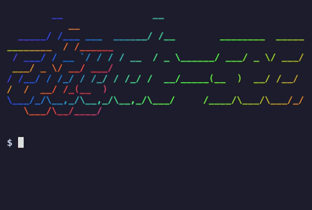
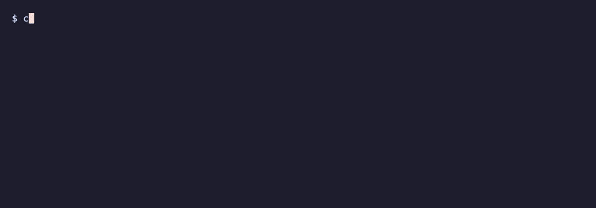
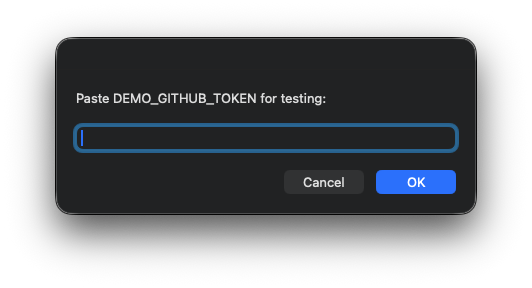

<div align="center">



# @vaultry/claude-secrets

**Encrypted token store for Claude Code sessions and your shell/apps.**
macOS Keychain backed · MCP server · CLI · `.env` placeholder expansion.

[](https://www.npmjs.com/package/@vaultry/claude-secrets)
[](https://www.npmjs.com/package/@vaultry/claude-secrets)
[](./LICENSE.md)
[](#requirements)
[](#requirements)

</div>

> **Stop pasting tokens into every new Claude session.** Store them once, reference them everywhere — including commit-safe `.env` files.

---

## Quick install (one line)

```bash
curl -fsSL https://raw.githubusercontent.com/vaultry/claude-secrets/main/install.sh | bash
```

Or via npm:

```bash
npm install -g @vaultry/claude-secrets
claude-secrets-setup
claude mcp add claude-secrets --scope user -- claude-secrets-mcp
```

---

## Three interfaces

| Interface | Who uses it | Policy-gated |
|-----------|-------------|--------------|
| **MCP server** | Claude Code sessions | Yes (per-project allowlist) |
| **CLI `claude-secrets`** | Your shell, apps, scripts | No (user has Keychain access) |
| **`.env` placeholders** | Any tool that reads .env | Via CLI |

---

## Store secrets


Pipe from stdin (keeps the value out of shell history):

```bash
echo "ghp_xxxxx" | claude-secrets set GITHUB_TOKEN
op read "op://Private/Gitea/token" | claude-secrets set GITEA_TOKEN
claude-secrets set DB_PASSWORD              # interactive — type, Ctrl-D
```

Encrypted with AES-256-GCM, master key stored in macOS Keychain (syncs between Macs via iCloud Keychain).

---

## Commit-safe `.env` files


Replace real values with `secret://NAME` references. The `.env` file can now be committed to git safely — it contains only names, no credentials.

```bash
# .env
API_KEY=secret://GITHUB_TOKEN
DB_URL=postgres://app:secret://DB_PASSWORD@db.local/app
PORT=3000
```

Placeholder syntax: `secret://NAME` — URI-style, avoids bash parameter-expansion collisions. Names can contain `A-Z`, `0-9`, `_`, `.`, `-`.

---

## Expand placeholders



Resolve placeholders to real values at runtime:

```bash
eval "$(claude-secrets export)"                    # into current shell
claude-secrets export --format json > resolved.json
claude-secrets export --format dotenv > .env.resolved

claude-secrets export --file .env.staging         # different file
claude-secrets export --on-missing empty          # empty for missing refs
```

| `--on-missing` | Behavior |
|----------------|----------|
| `throw` (default) | Exit 1 with list of missing names |
| `empty` | Placeholder becomes empty string |
| `keep` | Placeholder left literal (`secret://NAME`) |

---

## Run a command with secrets


```bash
claude-secrets exec -- pnpm dev                    # inject then run
claude-secrets exec -- node build.js
claude-secrets exec --file .env.prod -- npm run deploy
```

Secrets live only in the child process — not in the parent shell's environment, history, or `ps` output.

`package.json` scripts work seamlessly:

```json
{
  "scripts": {
    "dev": "claude-secrets exec -- ts-node src/index.ts",
    "test": "claude-secrets exec --file .env.test -- vitest",
    "deploy": "claude-secrets exec --file .env.prod -- node deploy.js"
  }
}
```

---

## MCP server (for Claude Code)

After registering with `claude mcp add`, Claude Code gets 6 tools under `mcp__claude-secrets__*`:

| Tool | Policy check | Effect |
|------|--------------|--------|
| `set_secret` | yes | Store/overwrite (requires allowlist) |
| `get_secret` | yes | Return value or `Denied` |
| `delete_secret` | yes | Remove or `Denied` |
| `list_secrets` | filter | `{total, visible, names}` |
| `search_secrets` | filter | Array of matches (regex, case-insensitive) |
| `input_secret` | yes | Native macOS dialog prompts user for value → stored directly. Value never passes through the model or chat. |

### `input_secret` — secure user input

<div align="center">



</div>

Use case: Claude needs a token the user hasn't stored yet. Instead of asking "please paste your token in chat" (which leaks the value into transcripts, API logs, and plan files), Claude calls `input_secret` — a native macOS dialog pops up, user types the value, value goes straight from dialog to encrypted store without Claude ever seeing it.

```
Claude: "I need a GITEA_TOKEN to push that branch. May I prompt you?"
User: "yes"
Claude: [calls input_secret with name=GITEA_TOKEN]
→ macOS dialog appears on your screen (hidden input)
→ you type the token, press OK
→ value stored in encrypted vault
→ Claude gets back "OK: 'GITEA_TOKEN' stored"
```

The value never appears in chat, transcripts, or API traffic.

`list` and `search` only return names that pass the allowlist. `total` shows the real count — Claude knows more secrets exist but can't see their names from a non-authorized project.

### Per-project allowlist — `.claude/secrets.yml`

Without this file: **all MCP reads and writes blocked** — prevents Claude in project A from reading or overwriting secrets from project B.

```yaml
allow:
  - GITEA_TOKEN
  - GITHUB_*            # glob patterns supported
  - OP_SERVICE_*
```

Special values:

```yaml
allow: "*"              # allow everything (not recommended)
```

```yaml
allow:
  - GITEA_TOKEN
inject_values: true     # SessionStart hook injects values (opt-in)
```

`secrets.yml` is safe to commit — it contains names only.

### SessionStart Hook (optional)

Inject available secret names into Claude's context at session start so Claude knows what's available without asking. Add to `~/.claude/settings.json`:

```json
{
  "hooks": {
    "SessionStart": [
      {
        "hooks": [
          {
            "type": "command",
            "command": "claude-secrets-session-hook"
          }
        ]
      }
    ]
  }
}
```

With `inject_values: true` in `secrets.yml`, the hook also injects values — they appear in transcripts, `history.jsonl`, plan files, and API logs. Only use for short-lived tokens in trusted projects. The hook emits a visible warning when values are injected.

---

## Slash commands for Claude Code

Two slash commands included in the package:

| Command | Effect |
|---------|--------|
| `/secret-set <NAME>` | Native macOS dialog (hidden input) → stored via CLI |
| `/secret-get <NAME>` | CLI fetch → copied to clipboard (value never in chat) |

Link them into Claude Code's commands directory:

```bash
ln -sf $(npm root -g)/@vaultry/claude-secrets/commands/secret-set.md ~/.claude/commands/secret-set.md
ln -sf $(npm root -g)/@vaultry/claude-secrets/commands/secret-get.md ~/.claude/commands/secret-get.md
```

(The one-line installer handles this automatically.)

---

## Security model

### Protects against

- Master key outside the encrypted file — held in Keychain, user-locked
- Per-project allowlist blocks cross-project leakage through Claude
- AES-256-GCM — authenticated encryption, tamper detection
- File mode `0600` — owner-only
- Atomic writes (write-to-temp + rename) — no partial-state corruption on crash
- `.env` with refs — commit-safe by construction
- `exec --` injection — secrets stay out of shell history and `ps` output

### Know the trade-offs

- **`inject_values: true`** puts values in Claude's system prompt → they appear in transcripts, `history.jsonl`, plan files, and API logs
- **CLI bypasses policy** — anyone with your user ID and an unlocked Mac can read all secrets (correct: Keychain is what protects you as a user, policy protects Claude from itself)
- **Keychain ACL** — after the first "Always Allow", `node` can read the key without a prompt
- **MCP writes are gated** by allowlist since v0.1 — prevents cross-project overwrites

### Not a defense against

- Malicious local processes running as your user
- Physical access to an unlocked Mac
- A compromised Keychain (root-level malware)

---

## CLI reference

```
claude-secrets help

  get <name>                         Print secret to stdout
  set <name> [value]                 Store secret (value from stdin if omitted)
  delete|rm <name>                   Delete a secret
  list|ls                            List all secret names
  search <pattern>                   Regex search (case-insensitive)

  export [--file .env]               Print 'export KEY=VAL' lines for shell eval
    [--format shell|dotenv|json]     Default: shell
    [--on-missing throw|empty|keep]  Default: throw

  exec [--file .env] -- <cmd...>     Run cmd with expanded env from .env
    [--on-missing throw|empty|keep]  Default: throw
```

---

## Architecture

```
~/.claude/
└── secrets.encrypted                # AES-256-GCM, mode 0600

@vaultry/claude-secrets (installed)
├── dist/
│   ├── index.js                     # MCP server (stdio)
│   ├── crypto.js                    # AES-256-GCM + Keychain I/O
│   ├── store.js                     # atomic read/write secrets.encrypted
│   ├── policy.js                    # isAllowed() via secrets.yml
│   ├── dotenv.js                    # .env parser + placeholder expansion
│   └── bin/
│       ├── setup.js                 # init CLI
│       ├── session-hook.js          # SessionStart hook
│       └── cli.js                   # claude-secrets CLI
└── commands/                        # Claude Code slash commands
```

**Encryption details**
- Algorithm: AES-256-GCM (authenticated encryption, tamper detection)
- IV: 12 bytes, random per write
- Key: 32 bytes, in macOS Keychain as service `claude-secrets-mcp`, account `master-key`
- File format: `{iv_b64}:{authtag_b64}:{ciphertext_b64}`
- Decrypted payload: JSON `{name: value}`
- Writes: temp-file + rename, atomic on POSIX

**Sync between Macs**
- iCloud Keychain auto-syncs the master key
- Sync `secrets.encrypted` via Dropbox/iCloud Drive/git-crypt if needed — it's useless without the key

---

## Requirements

- macOS (uses the `security` CLI for Keychain access)
- Node.js ≥ 18

Cross-platform support (Linux/Windows via `keytar`) is planned for v0.2.

---

## Workflow example

```bash
cd ~/projects/new-thing
git init

# Secrets already stored? Check:
claude-secrets search 'GITEA|DB'

# Add new ones:
op read "op://Private/Gitea/token" | claude-secrets set GITEA_TOKEN
claude-secrets set DB_PASSWORD              # type, Ctrl-D

# Commit-safe .env:
cat > .env <<EOF
GITEA_TOKEN=secret://GITEA_TOKEN
DATABASE_URL=postgres://app:secret://DB_PASSWORD@localhost:5432/mydb
PORT=3000
EOF

# Let Claude read specific tokens (optional):
mkdir -p .claude
cat > .claude/secrets.yml <<EOF
allow:
  - GITEA_TOKEN
  - DB_PASSWORD
EOF

# Dev server with secrets injected:
claude-secrets exec -- pnpm dev
```

---

## Troubleshooting

**"Keychain entry not found"**
Setup wasn't run. Run `claude-secrets-setup`.

**"Invalid ciphertext format"**
`secrets.encrypted` is corrupt or was encrypted with a different key. Restore from backup or delete and start over.

**Keychain prompt on every read**
Normal on the first session after login. Check "Always Allow". If it keeps prompting: Keychain Access app → find `claude-secrets-mcp` → right-click → Access Control → add the `node` binary.

**`claude-secrets: command not found`**
```bash
export PATH="$(npm bin -g):$PATH"
```

**MCP not visible in Claude**
```bash
claude mcp list | grep claude-secrets      # should show "✓ Connected"
```
If not: restart the Claude session.

**Secret in `.env` but expansion fails**
Check: `claude-secrets get NAME` — exists? Name match is case-sensitive. Placeholder syntax must be exactly `secret://` (not `@secrets:` or `${secrets:}`).

---

## Uninstall

```bash
claude mcp remove claude-secrets --scope user
security delete-generic-password -s claude-secrets-mcp -a master-key
rm ~/.claude/secrets.encrypted
npm uninstall -g @vaultry/claude-secrets
rm -f ~/.claude/commands/secret-set.md ~/.claude/commands/secret-get.md
# Remove the session-hook line from ~/.claude/settings.json manually
```

---

## License

Source-available under the **Vaultry Source-Available License v1.0**. Free for personal, educational, and internal use. Commercial use (resale, SaaS, bundled products) requires a separate commercial license — contact **mail@jorisslagter.nl**.

See [LICENSE.md](./LICENSE.md) for full terms.

---

<div align="center">

Made by [Joris Slagter](https://jorisslagter.nl) · [Report an issue](https://github.com/vaultry/claude-secrets/issues) · [npm](https://www.npmjs.com/package/@vaultry/claude-secrets)

</div>
